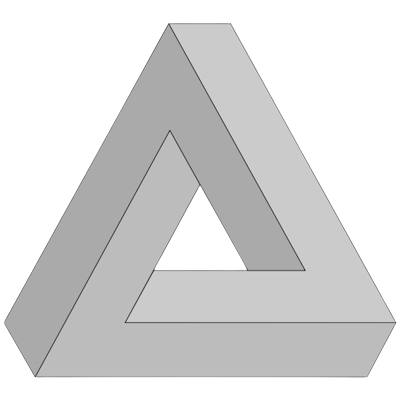

<p align="center">
    
</p>

<p align="center">
    
    
    
    
</p>

# its-hmny.github.io

## My personal website, hosted at https://its-hmny.github.io

This single page website is my personal portfolio, it's meant to be really minimal and clean. Showcase my skills as Fullstack Developer and give the interested reader a lot of external references to my articles, repositories and social media.

I sprinkled in some 3D models because everything is better when there's an interactive 3D model on the side, also I wanted to experiment further with React Three Fiber (R3F) after [3D Cellular Automata](https://github.com/its-hmny/3D-Cellular-Automata).

## Installation

To install the dependencies and run the site locally, simply type in your terminal:

```bash
  yarn install  # NOTE: npm or pnpm can be used as well
  yarn dev      # Start a hot reloadable dev server
  yarn build    # Build the bundled website for deploy
```

## Technology Stack

- [Typescript](https://www.typescriptlang.org/)
- [Vite](https://vitejs.dev/) | [React](https://reactjs.org/)
- [React Three Fiber](https://docs.pmnd.rs/react-three-fiber) | [drei](https://github.com/pmndrs/drei#readme) | [three.js](https://threejs.org/)

## Authors

- [@its-hmny](https://www.github.com/its-hmny) - Follow me on [Twitter](https://twitter.com/its_hmny) as well

## License

This project is distributed under the [GPLv3](https://choosealicense.com/licenses/gpl-3.0/) license.
